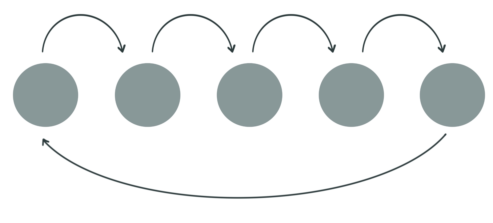
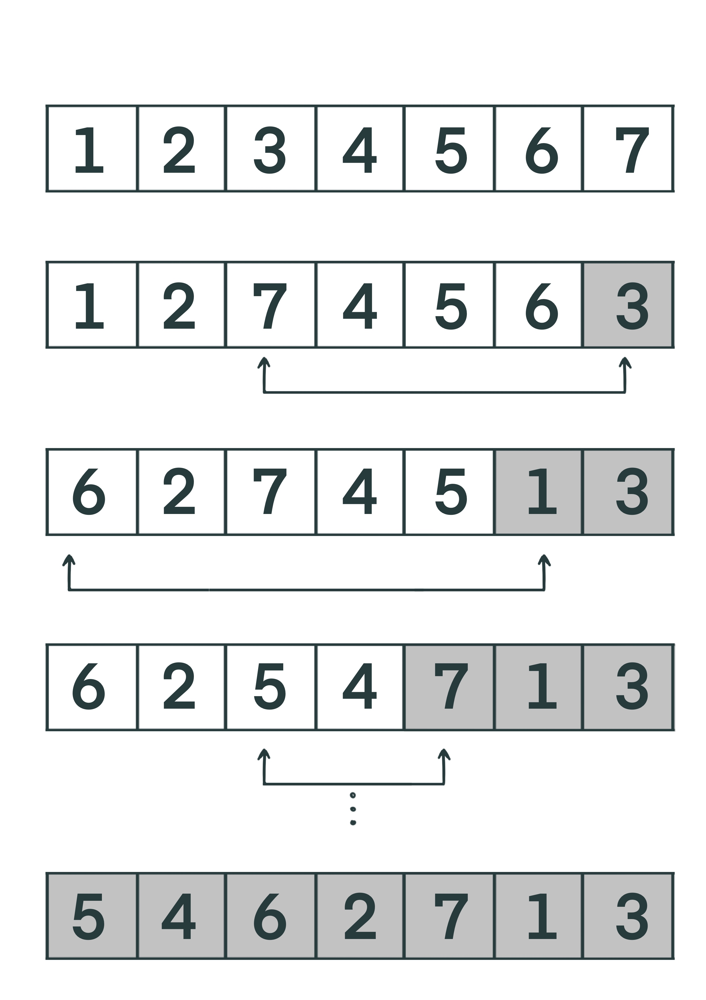

# Secret Santa 

## Opis Projekta

Ova aplikacija implementira sistem za "Secret Santa" igru, gdje uposlenici anonimno daruju jedni druge. Projekat koristi React za frontend. Postoje dvije uloge korisnika: Administrator i Uposlenik. Administratori imaju mogućnost kreiranja i pregleda lista uparenih uposlenika, dok ostali mogu vidjeti samo osobu kojoj treba da uzmu poklon.

### Pravila:

-   Uposlenik **ne može** kao par izvući **samog sebe**;
-   Isti par se **ne može** pojaviti **više puta** u listi;
-   Svakim generisanjem liste se treba dobiti **drugačija kombinacija** parova.

## Pokretanje koda
1. git clone https://github.com/zakiraskaljic/secret-santa.git
2. cd secret-santa
3. npm install 
4. npm start 

- Administrator username: zakira
- Ostali korisnici prate template ime  'John Doe',  username: john.doe

## Generisanje parova

Algoritam za generiranje parova je ključno rješenje ovog projekta. Kako funkcioniše:

1.  **Nasumično Miješanje Zaposlenika**: Prvo se lista zaposlenika (osim administratora) nasumično izmiješa kako bi se osiguralo da redoslijed bude drugačiji svaki put.
- Funkcija  **shuffleArray** koristi Fisher-Yates algoritam za nasumično miješanje elemenata u nizu.
2.  **Umetanje Administratora**: Administrator se uvijek dodaje u listu zaposlenika, ali na nasumičnoj poziciji.   
    -   Funkcija **insertAtRandomPosition** nasumično umeće administratora na neku poziciju u nizu
3.   **Kreiranje Parova**: Parovi se kreiraju tako da se svakom zaposleniku dodijeli naredni zaposlenik iz niza kao osoba kojoj treba kupiti poklon. Posljednji zaposlenik dobija prvog zaposlenika kao par.

    

## Fisher-Yates algoritam

Algoritam radi tako što prolazi kroz listu od posljednjeg do prvog elementa i za svaki element bira random indeks u nizu, a zatim zamijeni taj element sa trenutnim elementom.

    

